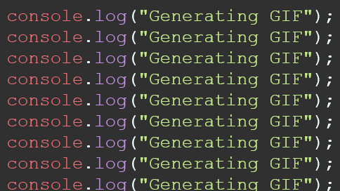
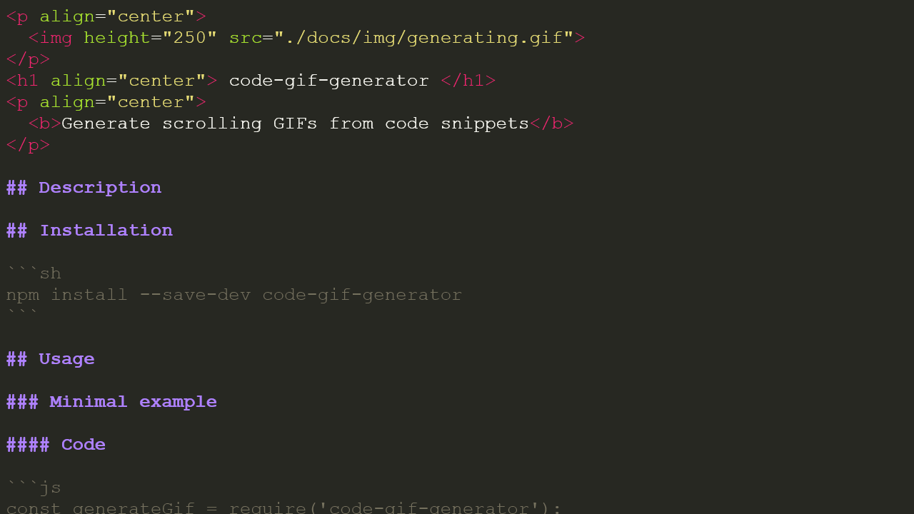

<p align="center">
  
</p>
<h1 align="center"> code-gif-generator </h1>
<p align="center">
  <b>Generate scrolling GIFs from code snippets</b>
</p>


## Description
Code-gif-generator is a tool for generating animated GIF files from code snippets.  
Use them to spice up your blog posts, documentation, or README files.  
Build on top of CodeMirror, more than 150 programming languages are supported.

## Installation

```sh
npm install --save code-gif-generator
```

## Usage

### Minimal example

#### Code

```js
const generateGif = require('code-gif-generator');

generateGif(`console.log('Hello World!')`).then(gif => gif.save());
```

#### Output

A single frame GIF in the current working directory:  


### Gif from this README file

#### Code

```js
const generateGif = require('code-gif-generator');

const createReadmeGif = async () => {
   // get the content of the README file
   const readmeContent =  await fs.promises.readFile('../README.md', 'utf8');
   // create a GIF from the readme file
   const gif = await generateGif(readmeContent, {
    preset: 'ultra',   // scroll slowly, up to 250 frames
    mode: 'markdown',   // pass the snippet programming language
    theme: 'monokai',   // theme for the code editor
    lineNumbers: false, // hide line numbers
  });
   // save the GIF in the docs/img folder
   const gifPath = await gif.save('readme-content', path.resolve(__dirname, '../docs/img'));
   return gifPath;
}

createReadmeGif().then(gifPath => console.log(`Gif saved: ${gifPath}`));
```

#### Output

A scrolling GIF in the docs/img folder:  



## API

### generateGif(`code`: string, `options`: object): *Promise‹[Gif](#gif)›*

Generate an animated GIF for a code snippet

**Parameters:**

▪ **code**: *string*

the code snippet

▪ **options**: *object*

Name | Type | Default | Description |
------ | ------ | ------ | ------ |
`mode` | string | "javascript" | code language |
`theme` | string | "material-darker" | code editor theme |
`preset` | string | "default" | [GIF preset](#presets) |
`lineNumbers` | boolean | true | whether to show line numbers |

**Returns:** *Promise‹[Gif](#gif)›*

the Gif instance object

___

### **Gif**

### Gif.save(`filename`: string, `outDir`: string, `compression?`: undefined | "lossy" | "losless"): *Promise‹string›*

Save the GIF to the filesystem

**Parameters:**

Name | Type | Default | Description |
------ | ------ | ------ | ------ |
`filename` | string | mode + timestamp | the filename for the gif (excluding extension) |
`outDir` | string | current working directory | the output directory for the GIF |
`compression?` | undefined &#124; "lossy" &#124; "losless" | - | compression to be used on the file |

**Returns:** *Promise‹string›*

the path of the saved GIF

___

### Gif.getBuffer(): *Promise‹Buffer›*

Get the GIF's buffer

**Returns:** *Promise‹Buffer›*

the buffer for the GIF

___

### Gif.getCompressedBuffer(`lossless`: boolean): *Promise‹Buffer›*

Get the GIF's compressed buffer

**Parameters:**

Name | Type | Description |
------ | ------ | ------ |
`lossless` | boolean | whether lossless compression is required |

**Returns:** *Promise‹Buffer‹››*

the compressed buffer for the GIF

___

### Presets

#### default

- scrolls 10% each frame
- maximum frames: 100

#### fast

- scrolls fast (20% each frame) 
- fast processing
- small filesizes
- maximum frames: 100

#### smooth

- scrolls very slowly (2% each frame)
- slow processing
- large filesize
- maximum frames: 100

#### ultra

- same as smooth
- (very) slow processing
- (very) large filesize
- maximum frames: 250

## Built with
- [CodeMirror](https://github.com/codemirror/CodeMirror)
- [pngjs](https://github.com/lukeapage/pngjs)
- [gif-encoder](https://github.com/twolfson/gif-encoder)
- [Puppeteer](https://github.com/puppeteer/puppeteer)

## License
[MIT](./LICENSE)
